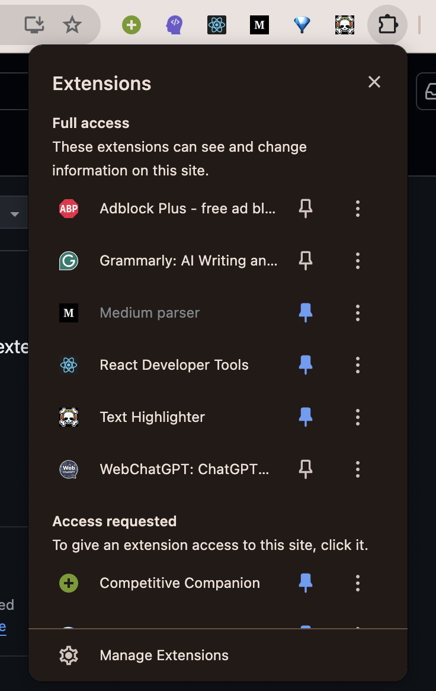
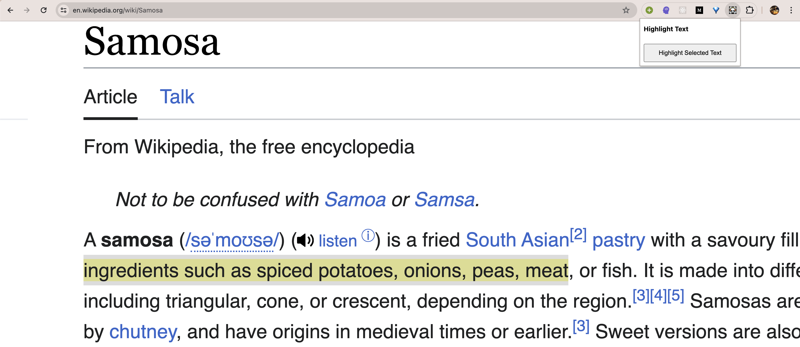

# This is how you can use this extension

1. Go to Manage Extension
   
2. Enable developer mode from top right.
3. Click on Load unpacked
4. Navigate to directory where you cloned this repo and select it.
5. Now simply select some text and click on the extension.
   
